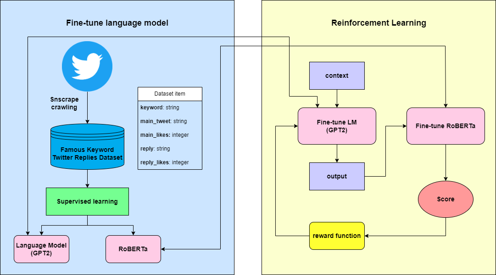

# Empowering-NLG

[](LICENSE)

| [Paper]() | [Code](https://github.com/jacksonchen1998/Empowering-NLG) | [Slide]() |

Official code for Empower NLG: Offline Reinforcement Learning for Informal Summarization in Online Domains

Code author: Zhi-Xuan Tai [contact email](will0010077.ee11@nycu.edu.tw)

## Abstract

This paper proposes a new approach to Natural Language Generation (NLG) that aims to improve user experience and reduce the workload of customer support agents. 

It focuses on generating natural language informal summaries for online articles and posts using an offline reinforcement learning method. 

The proposed method is compared to previous approaches to text generation, and the architecture of the design, including crawling, reinforcement learning, and text generation modules, is discussed. 

The contribution of this work lies in providing a novel approach to generating natural language summaries for online content, which can enhance customer support services and improve the user experience of online content consumption.

## Dataset

[Famous Keyword Twitter Replies](https://www.kaggle.com/datasets/jackksoncsie/famous-keyword-twitter-replies-dataset)

## Architecture



## Program information

- `dataprepare.py`: Data preprocessing
- `infer_gpt.py`: Infer GPT-2 model with unput text
- `infer_score.py`: Infer score with input text
- `model.py`: Score model based on GPT-2 and RoBERTa
- `trainRL.py`: Train PPO model, using GPT-2 and score model
- `traingpt.py`: Train GPT-2 model
- `trainscore.py`: Train score model

## Workflow

1. Data preprocessing
2. Train Score model (RoBERTa)
3. Train GPT-2 model
4. Train PPO model

## Training data sample Output (reply, score)

- Keyword: Covid-19

```
<article input> This man deserves life in jail for what he did. Faucci and the NIH funded gain of function research in Wuhan. He and the U.S. government literally created covid 19. <article end>
<response> Is this you? How many are weapons of mass destruction? <response end> 0.00
<response> You mean like your dad who created the vaccines cause it is still wanna be done with you? I thought you were a moron <response end> 0.00
<response> I thought this one took the prize (they must all be together), but you all did an excellent job of putting together anCOVID-19 campaign for Americans, Let's get this thing off the advice of Biden! <response end> 0.69
<response> I thought this was a bad idea. 🙄😂🤦‍♂️ <response end> 1.00
<response> Yes I did hear that one. It’s called working with the defense budget. You want to cut them? Just do away with them and their science? What are they help us toplain to others? <response end> 0.00
```

- Keyword: Bitcoin

```
<article input> Bitcoin and Crypto currency. I was built different 😴 <article end>
<response> Do you remember when you were young and you wanted to do something that will make the world better? I didn't know anything till now but let's just do it! <response end> 0.00
<response> Is this a meme? <response end> 1.00
<response> Is this a meme? <response end> 1.00
<response> Is this one for you??? #HODL <response end> 0.97
<response> Is this the first time you've done something like this? 😳🤯#Bitcoin #Ethereum # game development #BitcoinDay #DeFi <response end> 0.00
```

- Keyword: weather

```
<article input> Great question! Also, what about the weather?? Going to be a crazy 4 days <article end>
<response> This is a very long thread! Let’s all be sure to read it if you are interested. <response end> 0.00
<response> Is this serious?? And how does anyone think they're going to help the people who are dying from covid? We are living through a pandemic, and we thought this was a bad idea. <response end> 1.00
<response> Is there anyone out there that is going to tell me how to make it in life? <response end> 0.01
<response> Is it really that bad? It's about as close to aIndependence Day as you can get. <response end> 0.69
<response> I thought he was a bad idea. <response end> 0.99
```

## Citation

### Paper Citation

```

```

### Code Citation

```
@misc{20230611,
  author = {Zhi-Xuan Tai, Po-Chuan Chen},
  title = {Empower NLG: Offline Reinforcement Learning for Informal Summarization in Online Domains},
  year = {2023},
  month = {06},
  note = {Version 1.0},
  howpublished = {GitHub},
  url = {https://github.com/jacksonchen1998/Empowering-NLG}
}
```